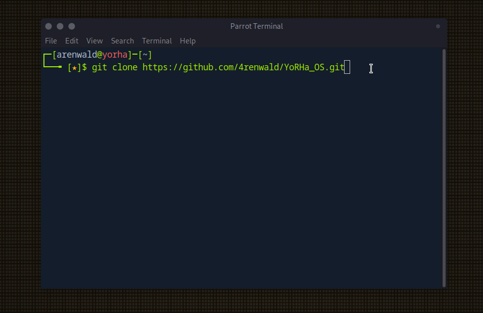

<div align="center">
  
  <h1>YoRHa_OS</h1>
    <br/>
  <br />
</div>

This repo is for my ParrotOS customization scripts, inspied from HTB's Pwnbox and my personal preferences. Couldn't find a better name so I called this YoRHa_OS since i'm a big fan, that's it🌚.


## Requirements
The script was tested on :
- [ParrotOS HTB Edition version 6.2 Lorikeet](https://deb.parrot.sh/parrot/iso/6.2/Parrot-htb-6.2_amd64.iso)

- [ParrotOS Security Edition version 6.2 Lorikeet](https://deb.parrot.sh/parrot/iso/6.2/Parrot-security-6.2_amd64.iso)

##  Usage
```
git clone https://github.com/4renwald/YoRHa_OS.git
sudo YoRHa_OS/setup.sh
```


Inside the script directory, a "logs" is created and contains each task's outputs in separated files.